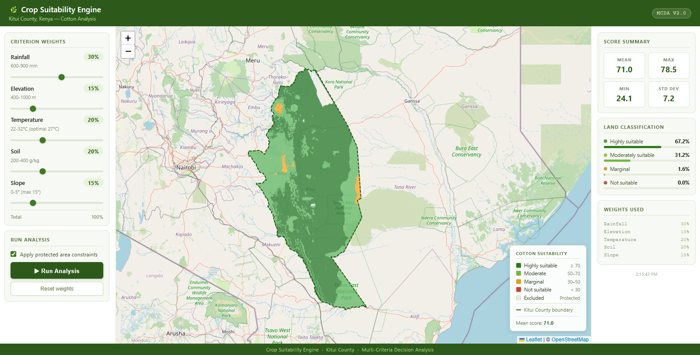

# 🌿 Crop Suitability Engine

A multi-criteria decision support system (MCDSS) for mapping crop suitability across Kenyan counties. Built for agricultural researchers, county governments, and NGOs who need spatially explicit suitability analysis without GIS expertise.

Currently configured for **cotton** across **Kitui** and **Bungoma** counties, with an architecture designed to onboard any crop and any county from a single JSON config file.

---

## Table of Contents

- [Overview](#overview)
- [Screenshots](#screenshots)
- [Tech Stack](#tech-stack)
- [Project Structure](#project-structure)
- [Data Requirements](#data-requirements)
- [Installation](#installation)
- [Running the Pipeline](#running-the-pipeline)
- [Running the App](#running-the-app)
- [API Reference](#api-reference)
- [Adding a New County](#adding-a-new-county)
- [Configuration Reference](#configuration-reference)
- [Data Sources](#data-sources)
- [Contributing](#contributing)

---

## Overview

The engine combines five biophysical criteria — elevation, rainfall, temperature, soil clay content, and slope — into a single 0–100 suitability score using **weighted overlay analysis**. Users can adjust criterion weights interactively and re-run the analysis in real time via the dashboard.

**Key capabilities:**

- Fuzzy membership normalization (trapezoidal, Gaussian, linear descending)
- Protected area constraint masking
- Interactive weight adjustment with instant re-analysis
- County boundary clipping and spatial alignment
- REST API serving analysis results as GeoTIFF and map-ready PNG tiles
- Sensitivity analysis to identify which criteria drive results most

**Analysis pipeline:**

```
Raw rasters → Preprocess → Realign → Normalize → Clip → API → Dashboard
```

---

## Screenshots

### Dashboard — 3-column layout



---

## Tech Stack

| Layer | Technology |
|---|---|
| Frontend | React 18, Leaflet / react-leaflet, Recharts, Axios |
| Backend API | FastAPI, Uvicorn |
| Geospatial | Rasterio, GeoPandas, NumPy, Shapely |
| Visualization | Pillow (PNG tile rendering) |
| Config | JSON per county, plain-text active county pointer |

---

## Project Structure

```
suitability-engine/
│
├── config/
│   ├── active_county.txt        # Set this to switch counties
│   ├── kitui.json               # Kitui county config
│   └── bungoma.json             # Bungoma county config
│
├── src/
│   ├── config.py                # Config loader — all scripts import from here
│   ├── preprocess.py            # Reproject, clip raw rasters to boundary
│   ├── realign_to_boundary.py   # Snap all rasters to a shared pixel grid
│   ├── normalize.py             # Apply fuzzy membership functions (0–100)
│   ├── clip_to_boundary.py      # Final clip + regenerate constraints mask
│   ├── suitability.py           # Weighted overlay engine + statistics
│   ├── sensitivity_analysis.py  # One-at-a-time weight sensitivity tests
│   └── api.py                   # FastAPI backend
│
├── frontend/
│   ├── public/
│   │   └── index.html
│   └── src/
│       ├── App.js               # Root component, 3-column layout
│       ├── App.css              # All styles
│       └── components/
│           ├── MapView.js       # Leaflet map + overlay + legend
│           ├── WeightControls.js # Criterion weight sliders
│           └── Statistics.js   # Score cards + classification bars
│
├── data/                        # Created at runtime — not committed
│   ├── counties/
│   │   └── kitui/
│   │       ├── boundaries/      # County boundary (.gpkg)
│   │       ├── raw/             # Downloaded rasters
│   │       ├── preprocessed/    # Clipped & reprojected
│   │       ├── processed/       # Aligned to shared grid
│   │       ├── normalized/      # 0–100 fuzzy scores
│   │       ├── results/         # CLI analysis outputs
│   │       └── api_results/     # Per-request GeoTIFFs + metadata
│   └── shared/
│       └── protected_areas_kenya.gpkg
│
├── requirements.txt
└── README.md
```

> **Note:** the `data/` directory is excluded from version control via `.gitignore`. All raster inputs must be sourced and placed locally — see [Data Requirements](#data-requirements).

---

## Data Requirements

Each county needs five raster layers (GeoTIFF format) placed in `data/counties/<county>/raw/`:

| File | Description | Recommended Source |
|---|---|---|
| `<county>_elevation.tif` | Digital Elevation Model (metres) | SRTM 30m via [OpenTopography](https://opentopography.org) |
| `<county>_rainfall.tif` | Mean annual rainfall (mm/year) | [CHIRPS](https://www.chc.ucsb.edu/data/chirps) |
| `<county>_temperature.tif` | Mean annual temperature (°C) | [WorldClim v2](https://www.worldclim.org/data/worldclim21.html) |
| `<county>_soil.tif` | Soil clay content (g/kg) | [SoilGrids 250m](https://soilgrids.org) |
| `<county>_slope.tif` | Terrain slope (degrees) | Derived from DEM using GDAL or QGIS |

You also need:

- **County boundary**: `data/counties/<county>/boundaries/<county>_boundary.gpkg` — any polygon source; Kenya county boundaries are available from [GADM](https://gadm.org) or the [Kenya Open Data portal](https://opendata.go.ke).
- **Protected areas** *(optional)*: `data/shared/protected_areas_kenya.gpkg` — download from [Protected Planet](https://www.protectedplanet.net). If absent, the constraint mask uses the county boundary only.

Raw files can be named either `elevation.tif` or `kitui_elevation.tif` — the pipeline auto-detects both.

---

## Installation

### 1. Clone the repository

```bash
git clone https://github.com/your-username/suitability-engine.git
cd suitability-engine
```

### 2. Python environment

```bash
python -m venv venv
source venv/bin/activate        # Windows: venv\Scripts\activate
pip install -r requirements.txt
```

### 3. Frontend dependencies

```bash
cd frontend
npm install
cd ..
```

### 4. Set the active county

```bash
echo "kitui" > config/active_county.txt
```

---

## Running the Pipeline

Run these steps **once** after placing raw data for a county. You only need to re-run them if the source data or normalization thresholds change.

```bash
# Step 1 — Reproject, clip, and build constraint mask
python src/preprocess.py

# Step 2 — Snap all layers to a shared pixel grid
python src/realign_to_boundary.py

# Step 3 — Apply fuzzy membership functions (produces 0–100 scores)
python src/normalize.py

# Step 4 — Clip normalized layers to county boundary
python src/clip_to_boundary.py
```

Each script prints a progress summary and flags any missing files. If a step fails, fix the issue it reports and re-run — completed steps are skipped automatically.

**Optional — run a standalone weighted overlay from the CLI:**

```bash
python src/suitability.py
```

**Optional — sensitivity analysis:**

```bash
python src/sensitivity_analysis.py
# Outputs to data/counties/<county>/sensitivity/
```

---

## Running the App

### Start the API

```bash
python src/api.py
# → http://localhost:8000
# → Docs at http://localhost:8000/docs
```

### Start the frontend

```bash
cd frontend
npm start
# → http://localhost:3000
```

Open `http://localhost:3000` in your browser. The map will centre on the active county and load the boundary outline. Adjust the sliders and click **Run Analysis** to generate a suitability overlay.

### Switching counties

```bash
echo "bungoma" > config/active_county.txt
# Restart the API — frontend picks up the new config automatically
python src/api.py
```

---

## API Reference

All endpoints are prefixed with `http://localhost:8000`.

### `GET /`
Returns a summary of available endpoints.

### `GET /health`
Returns API status, loaded layer count, and raster bounds.

### `GET /county`
Returns active county metadata for the frontend (name, crop, map centre, default weights).

**Response:**
```json
{
  "county": "kitui",
  "display_name": "Kitui County",
  "country": "Kenya",
  "crop": "Cotton",
  "map_center": [-1.37, 38.01],
  "map_zoom": 9,
  "weights": { "rainfall": 0.3, "elevation": 0.15, ... }
}
```

### `GET /criteria`
Returns per-criterion descriptions and optimal ranges.

### `GET /boundary-geojson`
Returns the county boundary as GeoJSON for the Leaflet overlay.

### `POST /analyze`
Runs weighted overlay and returns statistics + an `analysis_id` for the map image.

**Request body:**
```json
{
  "weights": {
    "rainfall": 0.30,
    "elevation": 0.15,
    "temperature": 0.20,
    "soil": 0.20,
    "slope": 0.15
  },
  "apply_constraints": true
}
```

**Response:**
```json
{
  "analysis_id": "20240115_143022",
  "county": "Kitui County",
  "raster_bounds": [[-3.2, 36.8], [0.4, 39.6]],
  "statistics": { "min": 0.0, "max": 98.4, "mean": 54.2, "std": 18.7, "median": 56.1 },
  "classification": {
    "highly_suitable_pct": 22.4,
    "moderately_suitable_pct": 35.1,
    "marginally_suitable_pct": 18.9,
    "not_suitable_pct": 8.3,
    "excluded_pct": 15.3
  },
  "weights_used": { "rainfall": 0.3, ... },
  "timestamp": "2024-01-15T14:30:22"
}
```

### `GET /map-image/{analysis_id}`
Returns the suitability raster as a transparent RGBA PNG, georeferenced to `raster_bounds`. Used by Leaflet's `ImageOverlay`.

Colour mapping:

| Score | Colour | Class |
|---|---|---|
| ≥ 70 | Dark green `#2d7a1b` | Highly suitable |
| 50–70 | Light green `#74b83e` | Moderate |
| 30–50 | Amber `#e0a020` | Marginal |
| < 30 | Red `#d04030` | Not suitable |
| 0 | Transparent | Excluded / No data |

### `GET /results/{analysis_id}`
Returns the full metadata JSON for a previous analysis.

### `GET /download/{analysis_id}`
Downloads the suitability GeoTIFF for use in GIS software (QGIS, ArcGIS).

---

## Adding a New County

1. **Create a config file** at `config/<county>.json`. Copy an existing one as a template and update:
   - `county`, `display_name`, `country`, `crop`
   - `map_center` and `map_zoom`
   - `layers` — raster filenames
   - `normalization` — fuzzy function type and thresholds per criterion
   - `weights` — default weight distribution (must sum to 1.0)
   - `criteria_info` — descriptions shown in the UI

2. **Place raw rasters** in `data/counties/<county>/raw/`

3. **Place the boundary** at `data/counties/<county>/boundaries/<county>_boundary.gpkg`

4. **Set as active** and run the pipeline:
   ```bash
   echo "<county>" > config/active_county.txt
   python src/preprocess.py
   python src/realign_to_boundary.py
   python src/normalize.py
   python src/clip_to_boundary.py
   ```

5. **Restart the API** — the frontend updates automatically.

No code changes are required. Everything is driven by the JSON config.

---

## Configuration Reference

Key fields in `config/<county>.json`:

```jsonc
{
  "county": "kitui",            // Unique identifier (lowercase, no spaces)
  "display_name": "Kitui County",
  "country": "Kenya",
  "crop": "Cotton",
  "map_center": [-1.37, 38.01], // [lat, lng] — map loads centred here
  "map_zoom": 9,
  "resolution": 0.005,          // Pixel size in degrees (~500m at equator)

  "layers": {
    "elevation": "kitui_elevation.tif"  // Filename in raw/ directory
    // ...
  },

  "normalization": {
    "elevation": {
      "type": "trapezoidal",    // "trapezoidal" | "gaussian" | "linear_descending"
      "params": { "a": 200, "b": 400, "c": 1000, "d": 1500 },
      "description": "ASAL lowland cotton 400-1000m optimal"
    },
    "temperature": {
      "type": "gaussian",
      "params": { "optimal": 27, "spread": 5 }
    },
    "slope": {
      "type": "linear_descending",
      "params": { "min_val": 0, "max_val": 15 }
    }
  },

  "weights": {
    "rainfall": 0.3             // Default weights — must sum to 1.0
    // ...
  }
}
```

**Fuzzy function reference:**

| Type | Shape | Use when |
|---|---|---|
| `trapezoidal` | Flat top, linear shoulders | Criterion has a clear optimal range |
| `gaussian` | Bell curve | Criterion has a single optimal point |
| `linear_descending` | Falls from min to max | Lower is always better (e.g. slope) |

---

## Data Sources

| Dataset | Source | License |
|---|---|---|
| SRTM Elevation | [OpenTopography](https://opentopography.org) | CC BY 4.0 |
| CHIRPS Rainfall | [UCSB CHC](https://www.chc.ucsb.edu/data/chirps) | Public domain |
| WorldClim Temperature | [WorldClim](https://www.worldclim.org) | CC BY 4.0 |
| SoilGrids Clay Content | [ISRIC](https://soilgrids.org) | CC BY 4.0 |
| Kenya County Boundaries | [GADM](https://gadm.org) | Academic use |
| Protected Areas | [Protected Planet](https://www.protectedplanet.net) | See terms |

---

## Contributing

Contributions are welcome. Useful areas to extend:

- Additional crop configs (maize, sorghum, cassava)
- More counties or cross-border regions
- Alternative normalization functions
- Export to PDF report
- Multi-crop comparison view

Please open an issue before submitting a pull request for significant changes.

---

*Built with FastAPI · React · Rasterio · Leaflet*